# Planejamento de Projeto: Plataforma AVA/LMS Estácio

## 1. Visão Geral do Projeto

### Resumo da Funcionalidade

Plataforma educacional completa (learning management system) compatível com padrões Estácio, fornecendo gestão de cursos, turmas, disciplinas, aulas em múltiplos formatos (vídeo, quiz, atividades, fórum), submissões de trabalhos e sistema de avaliações.

### Valor Empresarial

- **Objetivo Principal**: Criar uma solução LMS escalável e moderna que substitua sistemas legados
- **Métricas de Sucesso**:
  - 100+ cursos hospedados
  - 10K+ alunos sincronizados
  - Tempo de carregamento < 2s
  - 99.5% uptime
  - NPS > 8/10
- **Impacto para o Usuário**:
  - Professores: Ferramenta intuitiva para criar e gerenciar conteúdo online
  - Alunos: Experiência moderna de aprendizado com múltiplas mídias
  - Admin: Visibilidade completa e controle operacional

### Principais Marcos

1. **MVP - Estrutura Base** (Week 1-2): Database + APIs + Auth
2. **Funcionalidades Aluno** (Week 2-3): Dashboard, Cursos, Aulas, Submissões
3. **Funcionalidades Professor** (Week 3-4): Criar conteúdo, Avaliar, Notas
4. **Funcionalidades Admin** (Week 4): Relatórios, Gerenciamento
5. **QA & Otimização** (Week 5): Testes, Lint, Deploy

### Avaliação de Risco

| Risco                       | Probabilidade | Impacto | Mitigação                          |
| --------------------------- | ------------- | ------- | ---------------------------------- |
| Delays em UI components     | Alta          | Alto    | Usar shadcn/ui + Tailwind (pronto) |
| Performance em larga escala | Média         | Alto    | Implementar índices DB, cache      |
| Complexidade de permissões  | Média         | Médio   | Testes de permissão detalhados     |
| Integração Better Auth      | Baixa         | Médio   | Documentação + testes e2e          |

---

## 2. Hierarquia de Itens de Trabalho

### Diagrama de Epics e Features

```mermaid
graph TD
    A["🎓 Epic: EAD-LMS<br/>Plataforma Educacional"] --> B["📚 Feature: Gestão de Cursos"]
    A --> C["👥 Feature: Gestão de Turmas"]
    A --> D["📖 Feature: Aulas & Conteúdo"]
    A --> E["✏️ Feature: Atividades & Submissões"]
    A --> F["⭐ Feature: Avaliações & Notas"]
    A --> G["💬 Feature: Comunicação"]
    A --> H["🔧 Enabler: Infraestrutura"]

    B --> B1["Story: Criar Curso"]
    B --> B2["Story: Editar Curso"]
    B --> B3["Story: Listar Cursos"]

    C --> C1["Story: Criar Turma"]
    C --> C2["Story: Inscrever Aluno"]
    C --> C3["Story: Gerenciar Matrículas"]

    D --> D1["Story: Criar Aula Vídeo"]
    D --> D2["Story: Criar Quiz"]
    D --> D3["Story: Criar Aula Texto"]

    E --> E1["Story: Aluno Submeter Atividade"]
    E --> E2["Story: Professor Avaliar"]

    F --> F1["Story: Lançar Notas"]
    F --> F2["Story: Ver Boletim"]

    H --> H1["Enabler: API REST"]
    H --> H2["Enabler: Database Optimization"]
    H --> H3["Enabler: Testing Framework"]

    B1 --> B1T1["Task: Form Component"]
    B1 --> B1T2["Task: API Endpoint"]
    B1 --> B1T3["Task: Tests"]
```



---

## 3. Features Detalhadas

### 🎓 Epic: EAD-LMS - Plataforma Educacional

**Épico de alto nível cobrindo toda a plataforma educacional.**

#### Critérios de Aceitação Épicos

- [ ] Todos os serviços educacionais implementados (Course, Class, Discipline, Lesson, Enrollment, Submission)
- [ ] API RESTful completa com todas as rotas documentadas
- [ ] Dashboard funcional para aluno, professor e admin
- [ ] Testes de integração cobrindo fluxos críticos
- [ ] UX responsiva em desktop e mobile
- [ ] Performance: p95 < 2s, p99 < 5s

#### Definição de Pronto Épico

- [ ] Todas as Features concluídas
- [ ] Testes E2E: 80%+ cobertura
- [ ] Performance benchmarks atendidos
- [ ] Documentação API (OpenAPI/Swagger)
- [ ] Guia de usuário para aluno/professor/admin
- [ ] Deployment em staging validado

---

### 📚 Feature: Gestão de Cursos

**Permite que admins criem, editem e gerenciem cursos oferecidos na plataforma.**

#### Stories Incluídas

1. **Criar Curso** - Admin cria novo curso com código, nome, descrição
2. **Editar Curso** - Admin edita detalhes do curso
3. **Listar Cursos** - Usuários veem catálogo de cursos disponíveis
4. **Deletar Curso** - Admin remove curso (soft-delete)

#### Enablers

- [ ] Database schema com tabela courses
- [ ] Validação de código único
- [ ] Soft-delete de cursos
- [ ] Paginação de listagem

#### Critérios de Aceitação

- [ ] POST /api/courses cria curso com sucesso
- [ ] GET /api/courses retorna listagem paginada
- [ ] PUT /api/courses/:id atualiza campos permitidos
- [ ] DELETE /api/courses/:id efetua soft-delete
- [ ] Apenas admin pode criar/editar/deletar

#### Dependências

**Bloqueado por**: Enabler: Authentication & Auth Hooks

#### Rótulos

`feature`, `prioridade-alta`, `valor-alto`, `backend`, `database`

#### Estimativa

**Story Points**: 13 (2 + 3 + 5 + 3)

---

### 👥 Feature: Gestão de Turmas

**Permite criar turmas específicas de semestres/períodos para cada curso.**

#### Stories Incluídas

1. **Criar Turma** - Admin/Prof cria turma (T01, T02) com limites de capacidade
2. **Editar Turma** - Atualizar datas, capacidade, instrutor
3. **Listar Turmas** - Ver turmas de um curso
4. **Deletar Turma** - Remover turma vazia

#### Critérios de Aceitação

- [ ] POST /api/courses/:courseId/classes cria turma
- [ ] Turma é automaticamente vinculada a um instrutor
- [ ] GET retorna turmas de um curso com paginação
- [ ] Validação: semester em formato "YYYY.N"

#### Dependências

**Bloqueado por**: Feature: Gestão de Cursos

#### Rótulos

`feature`, `prioridade-alta`, `valor-alto`, `backend`

#### Estimativa

**Story Points**: 8

---

### 📖 Feature: Aulas & Conteúdo

**Gerenciamento de aulas com suporte a múltiplos tipos: vídeo, quiz, texto, arquivo, atividade, fórum, ao vivo.**

#### Stories Incluídas

1. **Criar Aula de Vídeo** - Prof cria aula com URL de vídeo + duração
2. **Criar Quiz** - Prof cria quiz com múltiplas questões
3. **Criar Aula de Texto** - Prof cria conteúdo textual (HTML)
4. **Criar Atividade** - Prof cria tarefa com data de entrega
5. **Listar Aulas** - Aluno vê aulas da disciplina
6. **Publicar Aula** - Prof publica aula para alunos

#### Enablers

- [ ] JSON storage para content polimórfico
- [ ] Validação de tipos de aula
- [ ] Ordenação de aulas (order field)
- [ ] Soft-delete de aulas

#### Critérios de Aceitação

- [ ] POST /api/disciplines/:disciplineId/lessons com type específico
- [ ] Content JSON validado conforme tipo
- [ ] GET /api/lessons/:lessonId retorna aula completa
- [ ] PUT /api/lessons/:lessonId atualiza conteúdo
- [ ] POST /api/lessons/:lessonId/publish define publishedAt

#### Dependências

**Bloqueado por**: Feature: Gestão de Turmas (precisa ligar a disciplinas)

#### Rótulos

`feature`, `prioridade-alta`, `valor-alto`, `backend`, `polimórfico`

#### Estimativa

**Story Points**: 21

---

### ✏️ Feature: Atividades & Submissões

**Alunos submeter trabalhos, professores avaliar e dar feedback.**

#### Stories Incluídas

1. **Aluno Submeter Atividade** - Upload/texto de tarefa
2. **Aluno Ver Submissões Anteriores** - Histórico de entregas
3. **Professor Listar Submissões** - Ver todas as entregas de uma atividade
4. **Professor Avaliar & Feedback** - Atribuir nota + comentário

#### Critérios de Aceitação

- [ ] POST /api/lessons/:lessonId/submit cria submissão
- [ ] Validação: apenas type=ACTIVITY permite submission
- [ ] GET /api/lessons/:lessonId/submissions (prof)
- [ ] PUT /api/submissions/:id/grade (prof) atualiza nota
- [ ] Aluno recebe notificação de avaliação (future)

#### Dependências

**Bloqueado por**: Feature: Aulas & Conteúdo

#### Rótulos

`feature`, `prioridade-alta`, `valor-alto`, `backend`, `submissions`

#### Estimativa

**Story Points**: 13

---

### ⭐ Feature: Avaliações & Notas

**Quizzes corrigidos automaticamente, notas consolidadas em boletim.**

#### Stories Incluídas

1. **Aluno Responder Quiz** - Responder questões múltipla escolha
2. **Sistema Corrigir Automaticamente** - Calcular score
3. **Professor Ver Respostas Erradas** - Analytics de questões difíceis
4. **Aluno Ver Boletim** - Consolidado de notas

#### Critérios de Aceitação

- [ ] POST /api/lessons/:lessonId/take-quiz submete respostas
- [ ] Respostas validadas, score calculado automaticamente
- [ ] GET /api/student/transcript retorna boletim consolidado
- [ ] Quiz pode ser feito múltiplas vezes (score máximo conta)

#### Dependências

**Bloqueado por**: Feature: Aulas & Conteúdo

#### Rótulos

`feature`, `prioridade-média`, `valor-alto`, `backend`, `analytics`

#### Estimativa

**Story Points**: 13

---

### 💬 Feature: Comunicação

**Fórum para discussão, anúncios, chat (futura).**

#### Stories Incluídas (MVP)

1. **Fórum: Criar Post** - Aluno/Prof cria tópico
2. **Fórum: Responder Post** - Adiciona reply
3. **Fórum: Listar Posts** - Paginado por aula

#### Critérios de Aceitação

- [ ] POST /api/lessons/:lessonId/forum criar post
- [ ] POST /api/forum/:postId/reply responder
- [ ] GET /api/lessons/:lessonId/forum listar threads

#### Dependências

**Bloqueado por**: Feature: Aulas & Conteúdo

#### Rótulos

`feature`, `prioridade-média`, `valor-médio`, `backend`, `comunicação`

#### Estimativa

**Story Points**: 8 (MVP simplificado)

---

### 🔧 Enablers Técnicos

#### Enabler: Integração de Autenticação

- Validação de roles (student, instructor, admin)
- Hooks de autorização por recurso
- **Estimativa**: 5 pts
- **Bloqueado por**: Nada (pré-existente - Better Auth)

#### Enabler: Otimização de Database

- Índices em courseId, classId, disciplineId, lessonId
- Índices em timestamps para paginação
- Validação de constraints única (class: courseId+semester+code)
- **Estimativa**: 5 pts

#### Enabler: Testing Framework

- Testes de integração com Vitest
- Fixtures de dados de teste
- Testes de permissões críticas
- **Estimativa**: 8 pts

#### Enabler: Web Components

- Integração com shadcn/ui
- Componentes genéricos: List, Form, Card, Modal
- **Estimativa**: 13 pts

---

## 4. Matriz de Prioridade e Valor

| Prioridade | Valor | Feature                 | Critério                    |
| ---------- | ----- | ----------------------- | --------------------------- |
| P0         | Alto  | Gestão de Cursos        | Caminho crítico, API base   |
| P0         | Alto  | Gestão de Turmas        | Habilita inscrições         |
| P1         | Alto  | Aulas & Conteúdo        | MVP: vídeo + quiz           |
| P1         | Alto  | Atividades & Submissões | Aluno consegue entregar     |
| P1         | Alto  | Avaliações & Notas      | Boletim funcional           |
| P2         | Médio | Comunicação             | Diferencial, não bloqueante |
| P0         | Alto  | Enablers Técnicos       | Suporta tudo                |

---

## 5. Timeline e Roadmap

```
Week 1-2: MVP Phase 1
  ├─ Database schema finalizado ✅
  ├─ Serviços de API implementados ✅
  ├─ Rotas de API documentadas 🔄
  └─ Testes de integração básicos

Week 2-3: MVP Phase 2
  ├─ Dashboard aluno
  ├─ Listagem de cursos/turmas
  ├─ Criação de aulas (vídeo)
  └─ Submissão de atividades

Week 3-4: MVP Phase 3
  ├─ Dashboard professor
  ├─ Avaliação de submissões
  ├─ Quiz automático
  └─ Boletim

Week 4-5: Polish & Deploy
  ├─ Web components refinement
  ├─ Performance optimization
  ├─ Lint & format (`pnpm lint`)
  ├─ Testes E2E
  └─ Deployment em staging
```

---

## 6. Critérios de Sucesso Técnico

- ✅ TypeScript strict mode (sem `any` desnecessário)
- ✅ Testes de integração para APIs críticas (>80% cobertura)
- ✅ Zod validation em 100% dos inputs/outputs
- ✅ Documentação de API (OpenAPI/Swagger)
- ✅ Performance: Page load < 2s (p95)
- ✅ Lint & format: `pnpm lint` sem erros
- ✅ Zero console.log em produção (use logger)
- ✅ Roles & permissões validadas em todas rotas

---

## 7. Definição de Pronto do Projeto

- [x] Database schema criado e migrações executadas
- [x] Serviços de negócio implementados
- [ ] Rotas API completamente implementadas
- [ ] Dashboard web pronto
- [ ] Testes de integração E2E completos
- [ ] Performance benchmarks atendidos (<2s, p95)
- [ ] Documentação de API completa
- [ ] Build sem erros: `pnpm typecheck`, `pnpm lint` ✅
- [ ] Deployment em staging validado
- [ ] Testes de aceitação do usuário completos
